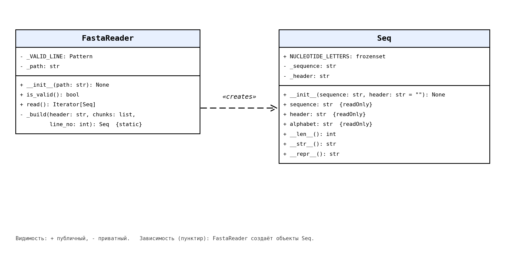

# fasta-tool

Небольшая библиотека на Python для чтения fasta-файлов. Написана без использования Biopython и других профильных библиотек.

Состоит из двух классов:
- `Seq` хранит одну последовательность и заголовок, умеет выдавать длину, красиво печататься и определять алфавит (нуклеотидный или белковый);
- `FastaReader` проверяет формат файла и читает его по записям через генератор, не загружая весь файл в память.

## Установка

Нужен Python 3.8 или новее. Внешние библиотеки не требуются.

```
git clone https://github.com/anasttassi/fasta-tool.git
cd fasta-tool
```

## Запуск демонстрационной программы

```
python3 demo.py
```

Программа обработает файлы из папки `examples/` (в том числе один специально некорректный). Можно указать свои файлы:

```
python3 demo.py examples/ncbi_insulin.fasta examples/uniprot_insulin.fasta
```

## Пример использования

```python
from fasta_tool import FastaReader

reader = FastaReader("examples/uniprot_insulin.fasta")
if reader.is_valid():
    for seq in reader.read():
        print(seq)
        print(len(seq), seq.alphabet)
```

## Документация

HTML-документация собрана с помощью Sphinx: откройте `docs/_build/html/index.html` в браузере.

Пересборка:

```
pip install sphinx
sphinx-build -b html docs docs/_build/html
```

## UML-диаграмма



## Структура проекта

- `fasta_tool/seq.py` - класс `Seq`
- `fasta_tool/reader.py` - класс `FastaReader`
- `demo.py` - демонстрационная программа
- `test_gen.py` - пример поэтапного чтения генератором
- `examples/` - тестовые fasta-файлы (NCBI, UniProt, некорректный файл)
- `docs/` - документация Sphinx
- `uml.png` - UML-диаграмма классов